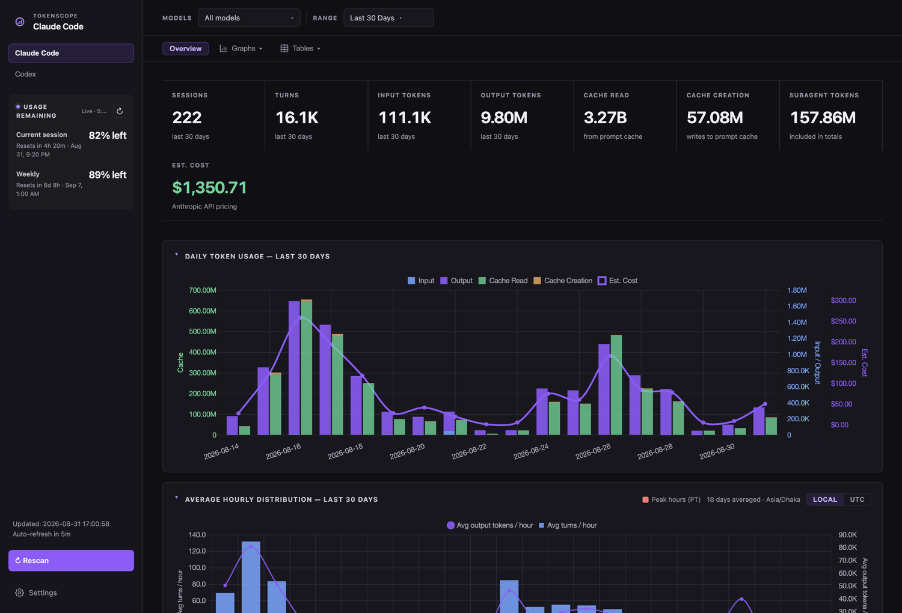
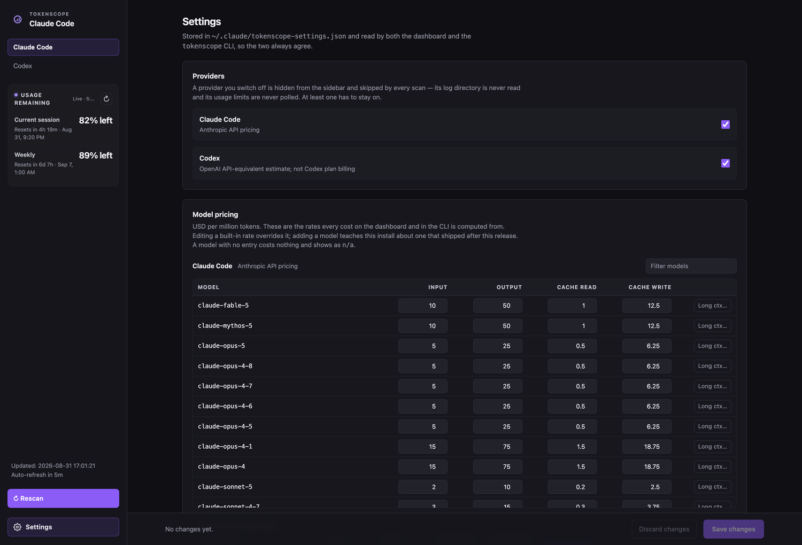

# TokenScope

[](LICENSE)
[](https://www.python.org/)
[](pyproject.toml)

**Your subscription gives you a progress bar. This gives you the whole picture.**

Claude Code and Codex both write detailed usage logs to your own disk — token counts,
models, sessions, projects, subagents — no matter which plan you are on. TokenScope
reads those logs and turns them into charts, tables, and cost estimates. Each provider
keeps its own tab, so models and pricing are never mixed.

Analysis and storage run locally. TokenScope never uploads your transcripts.



---

## Contents

- [What it tracks](#what-it-tracks)
- [Requirements](#requirements)
- [Quick start](#quick-start)
- [Commands](#commands)
- [Settings](#settings)
- [Cost estimates](#cost-estimates)
- [How it works](#how-it-works)
- [Project layout](#project-layout)
- [Contributing and security](#contributing-and-security)

---

## What it tracks

Works on **API, Pro, and Max plans** — the logs are written regardless of subscription type.

Captured:

- **Claude Code CLI** — `~/.claude/projects/`
- **Claude in Xcode** — the coding-assistant transcript directory
- **Codex** — local rollout sessions in `~/.codex/sessions/`

Not captured:

- **Cowork sessions** — these run server-side and write no local JSONL transcript.

What you get per provider: session and turn counts, input / output / cache-read /
cache-write tokens, reasoning tokens (Codex), estimated cost, a daily chart with a
cost overlay, an average-hourly-distribution chart, and tables by model, project,
project × branch, session, and subagent dispatch. Every table exports to CSV, every
section collapses, and the date range and model filter live in the URL so a view can
be bookmarked.

The sidebar also shows **usage remaining** per plan-limit window. Codex limits are
read from local rollout data. For Claude, TokenScope uses Claude Code's local sign-in
to request the current limits from Anthropic's OAuth usage endpoint; transcript
contents are not included in that request.

The dashboard loads Chart.js from jsDelivr. Apart from that browser asset and the
Claude usage-limit request above, transcript scanning and reporting stay on your
machine.

---

## Requirements

- [`uv`](https://docs.astral.sh/uv/) or [`pipx`](https://pipx.pypa.io/) for the recommended installation
- Python 3.8+ when installing with `pipx` or running directly from source
- No third-party Python packages. Standard library only (`sqlite3`, `http.server`, `json`, `pathlib`).
- Internet access for the dashboard's Chart.js asset and live Claude usage limits
- Docker and Bash only if you use the Docker option

---

## Quick start

Install TokenScope as an isolated command with `uv`:

```bash
uv tool install git+https://github.com/mtazbinur/tokenscope.git
```

Or with `pipx`:

```bash
pipx install git+https://github.com/mtazbinur/tokenscope.git
```

Then launch the dashboard from anywhere:

```bash
tokenscope dashboard
```

That scans your local Claude Code and Codex logs and opens <http://localhost:8080>.
Both installers keep TokenScope in an isolated environment; the application itself
has no third-party runtime dependencies.

### Run from source

If you prefer not to install the command, clone the repository and run it directly.

macOS / Linux:

```bash
git clone https://github.com/mtazbinur/tokenscope.git
cd tokenscope
python3 cli.py dashboard
```

Windows:

```bash
git clone https://github.com/mtazbinur/tokenscope.git
cd tokenscope
python cli.py dashboard
```

### Docker

```bash
bash scripts/run-docker.sh
```

Opens the dashboard at <http://localhost:9898>. The script builds the image, then runs
the container with:

- `~/.claude` mounted **read-only** — the container can read your transcripts, never modify them
- `~/.codex` mounted **read-only when present**
- a named volume (`tokenscope-data`) for the SQLite database and your settings file,
  persisted across restarts and isolated from your home directory

The dashboard has no authentication. The Docker script publishes port `9898` on all
host interfaces, so other devices may be able to reach it through your machine's
network address. Run it only on a trusted network or behind an appropriate firewall.

---

## Commands

The examples below assume installation with `uv` or `pipx`. When running from source,
replace `tokenscope` with `python3 cli.py` on macOS/Linux or `python cli.py` on Windows.

```bash
# Scan Claude Code and Codex logs into ~/.claude/usage.db
tokenscope scan

# Scan one provider explicitly
tokenscope scan --source claude_code
tokenscope scan --source codex

# Scan from custom locations
tokenscope scan --projects-dir /path/to/transcripts
tokenscope scan --source codex --codex-dir /path/to/codex/sessions

# Terminal summaries
tokenscope today          # today, by model
tokenscope week           # last 7 days, per-day + by-model
tokenscope stats          # all-time

# Dashboard
tokenscope dashboard
tokenscope dashboard --host 0.0.0.0 --port 9000
tokenscope dashboard --no-browser

# Environment variables work too
HOST=0.0.0.0 PORT=9000 tokenscope dashboard

tokenscope --version
```

The scanner is incremental: it records each file's path, mtime, and line count, so
re-running `scan` only processes what is new. The dashboard rescans automatically every
30 minutes; **Rescan** in the sidebar triggers the same non-destructive update immediately.

---

## Settings

Open **Settings** from the sidebar, or go straight to `?view=settings`.



### Providers

Switch a provider off and it disappears from the sidebar, its usage limits stop being
polled, and `scan` stops walking its log directory entirely. If you don't use Codex,
nothing about Codex is read. Both providers are on by default, and at least one has to
stay on.

### Model pricing

Every rate the dashboard and the CLI cost from, editable per provider in USD per
million tokens:

- **Correct a built-in rate.** The row is marked *Modified* and gets a **Reset** button.
  An edit that lands back on the built-in value is dropped rather than stored.
- **Add a model** that shipped after this release, so it stops costing $0 and showing
  as `n/a`. Added models resolve like built-in ones — exact match first, then longest
  matching prefix — so `claude-opus-6` also prices `claude-opus-6-20260101`.
- **Long-context tiers** (a threshold plus `long_*` rates) sit behind a per-model
  expander. One caveat: whether a stored turn crossed a threshold is decided when that
  turn is scanned, so a threshold change only affects turns scanned afterwards.

Nothing is written until you confirm it. Every control edits a draft; **Save changes**
opens a dialog listing exactly what will be written, the sidebar carries a dot while a
draft is unsaved, and closing the tab with unsaved edits warns first. A save applies
immediately — no restart — and the open dashboard re-prices in place.

Settings live in `~/.claude/tokenscope-settings.json` (override with the
`TOKENSCOPE_SETTINGS` environment variable) and are read by the dashboard *and* the
CLI, so the two can never report different costs.

---

## Cost estimates

Costs are computed **per turn** — each turn knows its own model — and then summed.
Aggregating tokens first and applying one price would misprice any session that spans
several models.

Rates live in [pricing.py](pricing.py) and are injected into the browser, so the CLI
and the dashboard cannot drift apart. 24 Claude models and 16 OpenAI
models ship with prices; a sample:

**Claude** — Anthropic API pricing

| Model | Input | Output | Cache write | Cache read |
|---|---|---|---|---|
| `claude-fable-5` | $10.00 | $50.00 | $12.50 | $1.00 |
| `claude-opus-5` | $5.00 | $25.00 | $6.25 | $0.50 |
| `claude-sonnet-5` | $2.00 | $10.00 | $2.50 | $0.20 |
| `claude-haiku-4-5` | $1.00 | $5.00 | $1.25 | $0.10 |

**Codex** — OpenAI API list prices

| Model | Input | Output | Cache write | Cache read |
|---|---|---|---|---|
| `gpt-5.6-sol` | $4.00 | $20.00 | $5.00 | $0.40 |
| `gpt-5.6-terra` | $2.00 | $12.00 | $2.50 | $0.20 |
| `gpt-5.6-luna` | $0.20 | $1.20 | $0.25 | $0.02 |

Two things worth knowing:

- **A model with no entry costs $0 and shows as `n/a`.** That is deliberate, so a local
  or third-party model (gemma, glm, …) isn't billed at Sonnet rates. The flip side is
  that a real model missing from the table silently costs nothing — add it in
  [Settings](#settings) when that happens.
- **These are API prices.** On a Max or Pro subscription your actual cost structure is
  a flat fee, not per token; the figure is what the same usage would have cost via the
  API. Codex figures are an API-equivalent estimate, never Codex plan billing.

---

## How it works

```
~/.claude/projects/**/*.jsonl  ─┐
Xcode coding-assistant dir     ─┼─→  scanner.parse_jsonl_file()
~/.codex/sessions/**/*.jsonl   ─┘            │
                                             ▼
                          aggregate_sessions() → SQLite (~/.claude/usage.db)
                                             │
                        ┌────────────────────┴────────────────────┐
                        ▼                                        ▼
                  cli.py queries                        dashboard.py /api/data
```

Claude Code writes one JSONL file per session. Each line is a JSON record, and
`assistant` records carry `message.usage.input_tokens`, `output_tokens`,
`cache_creation_input_tokens`, `cache_read_input_tokens`, and `message.model`.
A single API response spans several records and only the last one holds the final
tallies, so the parser keeps the last record per `message.id` rather than summing.

Codex rollout files are read from `~/.codex/sessions/` using session metadata, turn
context, and each response's `last_token_usage`; cumulative snapshots are never summed
twice, and reasoning output is kept as its own breakdown.

`dashboard.py` serves a single-page app from one embedded HTML string, with Chart.js
loaded from CDN. `GET /api/data` returns the whole history and the browser filters it,
so changing the range or the model filter costs no round trip. It reloads SQLite data
every five minutes when the selected range includes today, and incrementally rescans the
local log files every 30 minutes.

---

## Project layout

| File | Purpose |
|---|---|
| [scanner.py](scanner.py) | Parses JSONL transcripts into `~/.claude/usage.db`; holds `VERSION` |
| [cli.py](cli.py) | `scan`, `today`, `week`, `stats`, `dashboard` |
| [dashboard.py](dashboard.py) | HTTP server plus the entire single-page UI |
| [pricing.py](pricing.py) | The one price table, and the user-override layer |
| [quota.py](quota.py) | Plan-limit snapshots for the sidebar's usage panel |
| [settings.py](settings.py) | Enabled providers and price overrides, on disk |
| [Dockerfile](Dockerfile) | Container image |
| [scripts/run-docker.sh](scripts/run-docker.sh) | Build and run with read-only log mounts |

---

## Contributing and security

Contributions are welcome. See [CONTRIBUTING.md](CONTRIBUTING.md) for setup, testing,
project conventions, and the pull request checklist. Please report vulnerabilities
privately using [SECURITY.md](SECURITY.md), not through a public issue.

Detailed coding-agent and maintainer conventions remain in [AGENTS.md](AGENTS.md).
Version history is in [CHANGELOG.md](CHANGELOG.md).

---

## Credits

MIT licensed — see [LICENSE](LICENSE).

TokenScope grew out of [phuryn/claude-usage](https://github.com/phuryn/claude-usage)
by Paweł Huryn, also MIT licensed.
